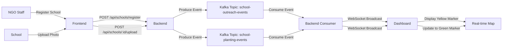

# 🌳 Green Zaria - Real-time Tree Planting Initiative Tracker

[](https://opensource.org/licenses/MIT)
[](https://www.docker.com/)
[](https://kafka.apache.org/)
[](https://nodejs.org/)

> A fully containerized, real-time system for tracking tree planting activities across schools in Zaria, Kaduna State, Nigeria. Built with Apache Kafka for instant updates and beautiful interactive maps.


---

## 📖 Table of Contents

- [Overview](#-overview)
- [Features](#-features)
- [Architecture](#-architecture)
- [Screenshots](#-screenshots)
- [Quick Start](#-quick-start)
- [Technology Stack](#-technology-stack)
- [Project Structure](#-project-structure)
- [Usage Guide](#-usage-guide)
- [API Documentation](#-api-documentation)
- [Configuration](#-configuration)
- [Development](#-development)
- [Deployment](#-deployment)
- [Troubleshooting](#-troubleshooting)
- [Contributing](#-contributing)
- [License](#-license)
- [Acknowledgments](#-acknowledgments)

---

## 🌍 Overview

**Green Zaria** is an NGO initiative designed to promote tree planting in Zaria City, Kaduna State. The platform provides real-time tracking of:

- 📍 Schools that have been outreached (Yellow markers)
- 🌳 Schools that have planted trees with verified evidence (Green markers)

The system uses **Apache Kafka** for real-time event streaming and **WebSocket** for instant dashboard updates, ensuring that every tree planting activity is immediately visible to stakeholders.

### The Problem
Traditional tree planting initiatives lack real-time visibility and verification mechanisms, making it difficult to track progress and maintain accountability.

### Our Solution
A modern, containerized platform that:
- Provides instant visibility of outreach efforts
- Enables photo verification of planting activities
- Offers real-time map-based tracking
- Uses enterprise-grade event streaming (Kafka)

---

## ✨ Features

### Core Functionality
- 🗺️ **Interactive Map Interface** - Leaflet.js-powered maps centered on Zaria
- 📍 **Coordinate Picker** - Click-to-select school locations with GPS coordinates
- 🔴→🟢 **Status Tracking** - Visual progression from Outreach (Yellow) to Planted (Green)
- 📸 **Photo Upload & Verification** - Drag-and-drop image uploads with preview
- ⚡ **Real-time Updates** - Kafka + WebSocket for instant map updates
- 🔐 **Access Token System** - Simple authentication for schools
- 📊 **Live Statistics** - Real-time counters for outreach and planting activities

### Technical Features
- 🐳 **Fully Dockerized** - One-command deployment
- 🚀 **Kafka Event Streaming** - Enterprise-grade message broker
- 🔄 **WebSocket Push** - No polling, instant updates
- 💾 **Local Image Storage** - Persistent volume for uploads
- 🏥 **Health Checks** - Automatic container monitoring
- 📈 **Kafka UI** - Built-in monitoring dashboard
- 🌐 **Nginx Reverse Proxy** - Efficient static file serving

---

## 🏗️ Architecture

```
┌─────────────────────────────────────────────────────────────┐
│                     Docker Network                           │
│                                                               │
│  ┌────────────┐    ┌──────────────┐    ┌───────────────┐   │
│  │   Kafka    │◄───│   Backend    │◄───│   Frontend    │   │
│  │  :9092     │    │ (Node.js +   │    │   (Nginx)     │   │
│  │  (KRaft)   │    │   Kafka +    │    │   :8080       │   │
│  └────────────┘    │  WebSocket)  │    └───────────────┘   │
│                    │   :3000      │                          │
│                    │   :3001      │                          │
│                    └──────────────┘                          │
│                                                               │
│  ┌────────────┐    ┌──────────────┐                         │
│  │  Kafka UI  │    │   Control    │                         │
│  │  :8090     │    │   Center     │                         │
│  └────────────┘    │   :9021      │                         │
│                    └──────────────┘                          │
└─────────────────────────────────────────────────────────────┘
```

### Data Flow



---

## 📸 Screenshots

### Registration Page

*Full-screen split layout with form and interactive map*

### Live Dashboard

*Real-time map with yellow (outreached) and green (planted) markers*

### Upload Portal

*Simple photo upload interface for schools*

---

## 🚀 Quick Start

### Prerequisites

- **Docker Desktop** (v20.10+)
- **Docker Compose** (v2.0+)
- **Git**

### Installation

```bash
# 1. Clone the repository
git clone https://github.com/yourusername/green-zaria.git
cd green-zaria

# 2. Create required directories
mkdir -p backend/uploads

# 3. Start all services
docker-compose up -d --build

# 4. Wait for services to be healthy (30-60 seconds)
docker-compose ps

# 5. Access the application
# Registration: http://localhost:8080/register.html
# Dashboard: http://localhost:8080/dashboard.html
# Upload: http://localhost:8080/upload.html
```

### Verify Installation

```bash
# Check all containers are running
docker-compose ps

# Should show:
# green-zaria-kafka        Up (healthy)
# green-zaria-backend      Up (healthy)
# green-zaria-frontend     Up
# green-zaria-kafka-ui     Up
# control-center           Up

# Test backend health
curl http://localhost:3000/health

# Expected response:
# {"status":"healthy","timestamp":"2024-..."}
```

---

## 🛠️ Technology Stack

### Backend
- **Node.js** 18.x - JavaScript runtime
- **Express** 4.x - Web framework
- **KafkaJS** 2.x - Kafka client for Node.js
- **Multer** - File upload handling
- **WebSocket (ws)** - Real-time communication
- **UUID** - Unique ID generation

### Frontend
- **HTML5 / CSS3** - Modern web standards
- **Vanilla JavaScript** - No framework overhead
- **Leaflet.js** 1.9.x - Interactive maps
- **OpenStreetMap** - Map tiles

### Infrastructure
- **Apache Kafka** 7.6.0 (KRaft mode) - Event streaming
- **Nginx** Alpine - Static file server & reverse proxy
- **Docker** - Containerization
- **Docker Compose** - Multi-container orchestration

### Monitoring
- **Kafka UI** - Topic and message monitoring
- **Confluent Control Center** - Enterprise Kafka monitoring

---

## 📁 Project Structure

```
green-zaria/
├── docker-compose.yml          # Multi-container orchestration
├── jaas.conf                   # Kafka authentication config
├── README.md                   # This file
├── LICENSE                     # MIT License
│
├── backend/                    # Node.js backend service
│   ├── Dockerfile             # Backend container definition
│   ├── package.json           # Node.js dependencies
│   ├── server.js              # Main application server
│   └── uploads/               # Image storage (volume mounted)
│
└── frontend/                   # Nginx frontend service
    ├── Dockerfile             # Frontend container definition
    ├── nginx.conf             # Nginx configuration
    ├── register.html          # School registration page
    ├── dashboard.html         # Real-time map dashboard
    └── upload.html            # Photo upload portal
```

---

## 📚 Usage Guide

### For NGO Staff (Registration)

1. **Access Registration Page**
   ```
   http://localhost:8080/register.html
   ```

2. **Fill School Details**
   - School Name: "Government Secondary School Zaria"
   - Address: Full street address
   - Contact Person: Principal/Coordinator name
   - Contact Phone: +234 format

3. **Select Location**
   - Click on the map at the school's exact location
   - Coordinates will display below the map

4. **Submit Registration**
   - Click "Register School"
   - **Save the Access Token** - provide it to the school
   - School appears as yellow marker on dashboard

### For Schools (Upload Evidence)

1. **Access Upload Page**
   ```
   http://localhost:8080/upload.html
   ```

2. **Enter Credentials**
   - School ID: Provided by NGO during registration
   - Access Token: Unique token from registration

3. **Upload Photo**
   - Drag & drop or click to select image
   - Supported formats: JPG, PNG (max 5MB)
   - Preview image before upload

4. **Submit**
   - Click "Upload Evidence"
   - School marker turns green on dashboard
   - Photo visible when clicking marker

### For Monitoring (Dashboard)

1. **Access Dashboard**
   ```
   http://localhost:8080/dashboard.html
   ```

2. **View Real-time Updates**
   - Yellow markers: Outreached schools
   - Green markers: Schools with planted trees
   - Click markers to view details and photos
   - Statistics update automatically

3. **Navigate**
   - Zoom: Mouse wheel or +/- buttons
   - Pan: Click and drag
   - Click school in sidebar to focus on map

---

## 🔌 API Documentation

### Base URL
```
http://localhost:3000/api
```

### Endpoints

#### 1. Register School (Outreach)

```http
POST /api/schools/register
Content-Type: application/json

{
  "name": "School Name",
  "address": "Full Address",
  "coordinates": {
    "lat": 11.0892,
    "lng": 7.7186
  },
  "contactPerson": "Principal Name",
  "contactPhone": "+234 800 000 0000"
}
```

**Response:**
```json
{
  "message": "School registered successfully",
  "schoolId": "abc-123-xyz",
  "accessToken": "token-456-def",
  "school": {
    "schoolId": "abc-123-xyz",
    "name": "School Name",
    "coordinates": {...},
    "status": "OUTREACHED"
  }
}
```

#### 2. Upload Planting Evidence

```http
POST /api/schools/:schoolId/upload-planting
Content-Type: multipart/form-data

Form Fields:
- plantingImage: File (image)
- accessToken: String
```

**Response:**
```json
{
  "message": "Planting evidence uploaded successfully",
  "school": {
    "schoolId": "abc-123-xyz",
    "name": "School Name",
    "status": "PLANTED",
    "imageUrl": "/uploads/image.jpg"
  }
}
```

#### 3. Get All Schools

```http
GET /api/schools
```

**Response:**
```json
[
  {
    "schoolId": "abc-123-xyz",
    "name": "School Name",
    "coordinates": {"lat": 11.0892, "lng": 7.7186},
    "status": "PLANTED",
    "plantingImage": "/uploads/image.jpg"
  }
]
```

#### 4. Health Check

```http
GET /health
```

**Response:**
```json
{
  "status": "healthy",
  "timestamp": "2024-01-01T00:00:00.000Z"
}
```

---

## ⚙️ Configuration

### Environment Variables

Edit `docker-compose.yml` to configure:

```yaml
backend:
  environment:
    - KAFKA_BROKERS=kafka:9092          # Kafka broker address
    - PORT=3000                         # Backend API port
    - WS_PORT=3001                      # WebSocket port
    - NODE_ENV=production               # Environment
    - KAFKA_SASL_ENABLED=false          # Enable SASL auth
```

### Kafka Configuration

Default Kafka settings in `docker-compose.yml`:

```yaml
kafka:
  environment:
    KAFKA_AUTO_CREATE_TOPICS_ENABLE: 'true'  # Auto-create topics
    KAFKA_OFFSETS_TOPIC_REPLICATION_FACTOR: 1
    KAFKA_TRANSACTION_STATE_LOG_REPLICATION_FACTOR: 1
```

### Ports

| Service | Port | Purpose |
|---------|------|---------|
| Frontend | 8080 | Web interface |
| Backend API | 3000 | REST API |
| WebSocket | 3001 | Real-time updates |
| Kafka | 9092 | Internal broker |
| Kafka (External) | 29092 | Host access |
| Kafka UI | 8090 | Monitoring dashboard |
| Control Center | 9021 | Enterprise monitoring |

---

## 👨‍💻 Development

### Local Development Setup

```bash
# 1. Clone and enter directory
git clone https://github.com/yourusername/green-zaria.git
cd green-zaria

# 2. Install backend dependencies locally (optional)
cd backend
npm install
cd ..

# 3. Start services with live reload
docker-compose up --build

# 4. Make changes to code
# Backend: backend/server.js
# Frontend: frontend/*.html

# 5. Restart specific service
docker-compose restart backend
```

### Viewing Logs

```bash
# All services
docker-compose logs -f

# Specific service
docker-compose logs -f backend
docker-compose logs -f kafka

# Last 100 lines
docker-compose logs --tail=100 backend
```

### Database Alternative

For production, replace in-memory storage with PostgreSQL:

```yaml
# Add to docker-compose.yml
postgres:
  image: postgres:15-alpine
  environment:
    POSTGRES_DB: green_zaria
    POSTGRES_USER: admin
    POSTGRES_PASSWORD: secret
  volumes:
    - postgres-data:/var/lib/postgresql/data
```

### Testing Kafka

```bash
# List topics
docker exec -it green-zaria-kafka kafka-topics \
  --list --bootstrap-server localhost:9092

# Consume outreach events
docker exec -it green-zaria-kafka kafka-console-consumer \
  --bootstrap-server localhost:9092 \
  --topic school-outreach-events \
  --from-beginning

# Consume planting events
docker exec -it green-zaria-kafka kafka-console-consumer \
  --bootstrap-server localhost:9092 \
  --topic school-planting-events \
  --from-beginning
```

---

## 🚢 Deployment

### Production Considerations

1. **Security**
   - Enable HTTPS with SSL certificates
   - Implement proper authentication
   - Use secrets management (Vault, AWS Secrets Manager)
   - Enable Kafka SASL authentication
   - Add rate limiting

2. **Scalability**
   - Increase Kafka partitions for topics
   - Use multiple Kafka brokers (replication factor > 1)
   - Load balance backend with multiple instances
   - Use cloud storage (S3, Azure Blob) for images

3. **Monitoring**
   - Add Prometheus + Grafana for metrics
   - Set up log aggregation (ELK stack)
   - Configure alerts for system health
   - Enable distributed tracing

4. **Backup**
   - Regular database backups
   - Kafka topic snapshots
   - Image storage backups

### Docker Swarm Deployment

```bash
# Initialize swarm
docker swarm init

# Deploy stack
docker stack deploy -c docker-compose.yml green-zaria

# Scale backend
docker service scale green-zaria_backend=3
```

### Kubernetes Deployment

Create Kubernetes manifests:

```yaml
# k8s/deployment.yaml
apiVersion: apps/v1
kind: Deployment
metadata:
  name: green-zaria-backend
spec:
  replicas: 3
  selector:
    matchLabels:
      app: backend
  template:
    metadata:
      labels:
        app: backend
    spec:
      containers:
      - name: backend
        image: green-zaria/backend:latest
        ports:
        - containerPort: 3000
        - containerPort: 3001
```

---

## 🔧 Troubleshooting

### Common Issues

#### 1. Containers Won't Start

```bash
# Check Docker is running
docker ps

# View detailed logs
docker-compose logs

# Remove all containers and start fresh
docker-compose down -v
docker-compose up --build
```

#### 2. Kafka Connection Failed

```bash
# Check Kafka health
docker exec green-zaria-kafka kafka-broker-api-versions \
  --bootstrap-server localhost:9092

# Restart Kafka
docker-compose restart kafka

# Check Kafka logs
docker-compose logs kafka
```

#### 3. WebSocket Not Connecting

- Check browser console for errors
- Verify port 3001 is not blocked by firewall
- Ensure backend is healthy: `curl http://localhost:3000/health`

#### 4. Images Not Loading

```bash
# Check uploads directory
ls -la backend/uploads/

# Verify volume mount
docker inspect green-zaria-backend | grep uploads

# Check backend logs
docker-compose logs backend | grep upload
```

#### 5. Map Not Loading

- Check internet connection (OpenStreetMap requires internet)
- Verify browser console for errors
- Try refreshing the page

### Health Check Commands

```bash
# Backend health
curl http://localhost:3000/health

# Frontend health
curl http://localhost:8080

# Kafka health
docker exec green-zaria-kafka kafka-broker-api-versions \
  --bootstrap-server localhost:9092

# Check all containers
docker-compose ps
```

---

## 🤝 Contributing

We welcome contributions from the community! Here's how you can help:

### Getting Started

1. **Fork the repository**
2. **Clone your fork**
   ```bash
   git clone https://github.com/yourusername/green-zaria.git
   ```
3. **Create a feature branch**
   ```bash
   git checkout -b feature/amazing-feature
   ```
4. **Make your changes**
5. **Commit with clear messages**
   ```bash
   git commit -m "Add: Amazing new feature"
   ```
6. **Push to your fork**
   ```bash
   git push origin feature/amazing-feature
   ```
7. **Open a Pull Request**

### Contribution Guidelines

- Follow existing code style
- Add tests for new features
- Update documentation
- Keep commits atomic and well-described
- Ensure all tests pass before submitting PR

### Areas for Contribution

- 🐛 Bug fixes
- ✨ New features (SMS notifications, analytics, etc.)
- 📝 Documentation improvements
- 🎨 UI/UX enhancements
- 🧪 Test coverage
- 🌍 Internationalization (i18n)
- ♿ Accessibility improvements

---

## 📄 License

This project is licensed under the MIT License - see the [LICENSE](LICENSE) file for details.

```
MIT License

Copyright (c) 2024 Green Zaria Initiative

Permission is hereby granted, free of charge, to any person obtaining a copy
of this software and associated documentation files (the "Software"), to deal
in the Software without restriction, including without limitation the rights
to use, copy, modify, merge, publish, distribute, sublicense, and/or sell
copies of the Software, and to permit persons to whom the Software is
furnished to do so, subject to the following conditions:

The above copyright notice and this permission notice shall be included in all
copies or substantial portions of the Software.

THE SOFTWARE IS PROVIDED "AS IS", WITHOUT WARRANTY OF ANY KIND, EXPRESS OR
IMPLIED, INCLUDING BUT NOT LIMITED TO THE WARRANTIES OF MERCHANTABILITY,
FITNESS FOR A PARTICULAR PURPOSE AND NONINFRINGEMENT.
```

---

## 🙏 Acknowledgments

- **OpenStreetMap** - Free map data
- **Leaflet.js** - Interactive mapping library
- **Apache Kafka** - Event streaming platform
- **Confluent** - Kafka Docker images
- **Node.js Community** - Excellent ecosystem
- **Zaria Community** - For supporting this initiative

---

## 📞 Contact & Support

- **Project Lead**: [Your Name](mailto:your.email@example.com)
- **Organization**: Green Zaria Initiative
- **Location**: Zaria, Kaduna State, Nigeria
- **Issues**: [GitHub Issues](https://github.com/yourusername/green-zaria/issues)
- **Discussions**: [GitHub Discussions](https://github.com/yourusername/green-zaria/discussions)

---

## 🌟 Star History

[](https://star-history.com/#yourusername/green-zaria&Date)

---

## 📊 Project Stats


---

## 🗺️ Roadmap

### Version 1.0 (Current)
- ✅ Real-time school registration
- ✅ Interactive map with markers
- ✅ Photo upload and verification
- ✅ Kafka event streaming
- ✅ Docker containerization

### Version 1.1 (Planned)
- [ ] Database persistence (PostgreSQL)
- [ ] User authentication system
- [ ] SMS notifications for schools
- [ ] Analytics dashboard
- [ ] Export reports (PDF/Excel)

### Version 2.0 (Future)
- [ ] Mobile app (React Native)
- [ ] Multiple tree species tracking
- [ ] Carbon offset calculations
- [ ] Leaderboard system
- [ ] API for third-party integrations
- [ ] Multi-language support

---

## 💚 Support the Project

If you find this project helpful, please consider:

- ⭐ Starring the repository
- 🐛 Reporting bugs
- 💡 Suggesting new features
- 📖 Improving documentation
- 🌱 Planting trees in your community!

---

**Made with 💚 for a greener Zaria**

**Green Zaria Initiative** - Making Zaria Greener, One Tree at a Time! 🌳